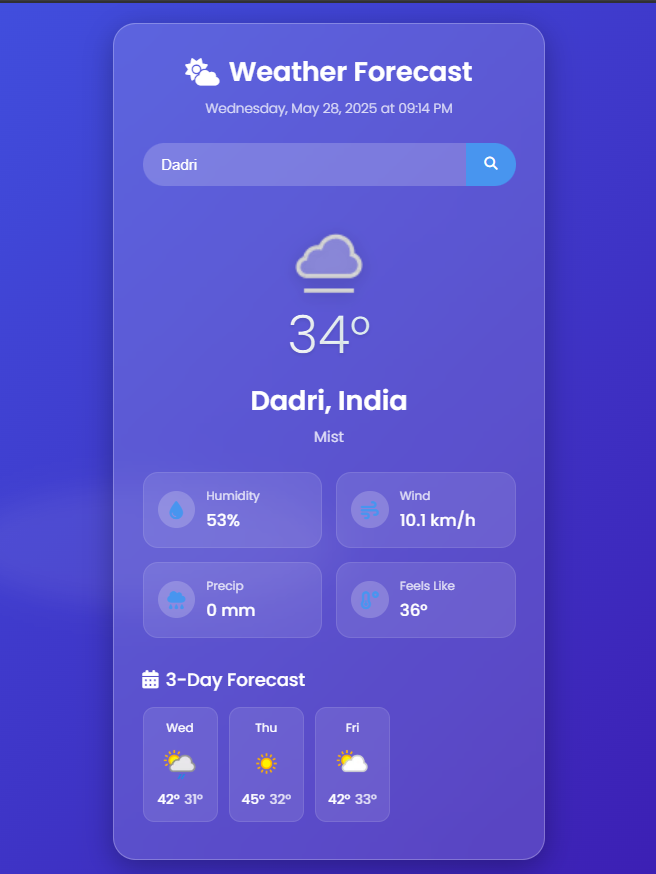

# Weather Forecast App



A beautiful, responsive weather application that displays current weather conditions and a 3-day forecast using the WeatherAPI.com service.

🔗 **Live Demo**: [weather-app.vercel.app](https://weather-app-git-main-tanay-mehtas-projects-35779685.vercel.app/)  
📦 **GitHub Repository**: [github.com/mehtatanay04/Weather-App](https://github.com/mehtatanay04/Weather-App/)

---

## 🌟 Features

- 🌦️ Real-time weather data for any location  
- 📍 Automatic location detection (with permission)  
- 🔍 City search functionality  
- 📅 3-day weather forecast  
- 🌈 Dynamic weather animations (sun, rain, snow)  
- 📱 Fully responsive design  
- ⏰ Current date and time display  
- 🔄 Loading states and error handling  

---

## 🛠️ Technologies Used

- HTML5  
- CSS3 (with CSS Variables)  
- JavaScript (ES6)  
- [WeatherAPI.com](https://www.weatherapi.com/) (weather data)  
- Google Fonts (Poppins)  
- Font Awesome (icons)  

---

## 🚀 Live Application

You can try the live version here:  
👉 **[weather-app.vercel.app](https://weather-app-git-main-tanay-mehtas-projects-35779685.vercel.app/)**

---

## 📥 How to Clone and Use This Project

To use this app with your own WeatherAPI key:

1. **Clone the repository**  
   ```bash
   git clone https://github.com/mehtatanay04/Weather-App.git
   cd Weather-App
